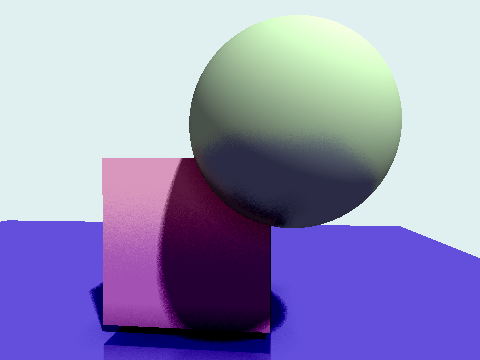
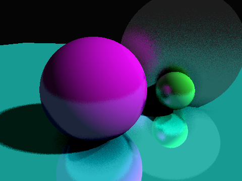
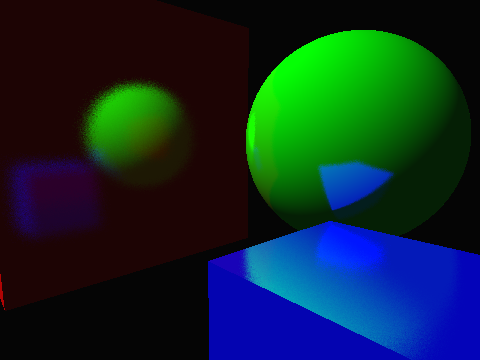

# HTML RayTracing

A toy real-time CPU raytracer written in TypeScript and rendered in a HTML5 canvas. Since it is not hardware accelerated, its performance is far from acceptable for real-time rendering but can be useful for understanding the raytracing algorithm and inner workings.

## Screenshots

# Features
- Cubes, Spheres, Planes and Circles geometries.
- Material based rendering.
- Directional shadows.
- Reflections.
- Ambient occlusion.

# Usage
Just open `public/index.html` in your browser.
## Camera Controls
- __Drag with left button__: Move in the XZ plane.
- __Drag with right button__: Rotate Yaw and Pitch.
- __Drag with both buttons__: Move in the XY plane.

## Selected Object Controls
- To select an object, click on it.
- __WASD__: Move a selected object the XY plane.
- __Q, E__: Move a selected object in the Z axis.
- __DEL__: Delete a selected object.

# Development
- `npm install`: to install dependencies.
- `npm run dev`: to start the development server and watch for changes.
- `npm run build`: to build the project.